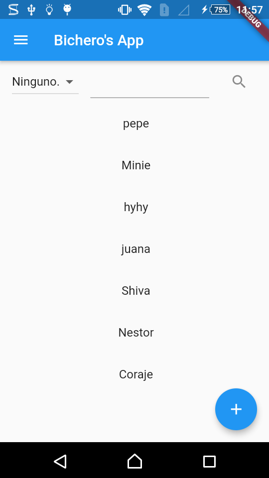
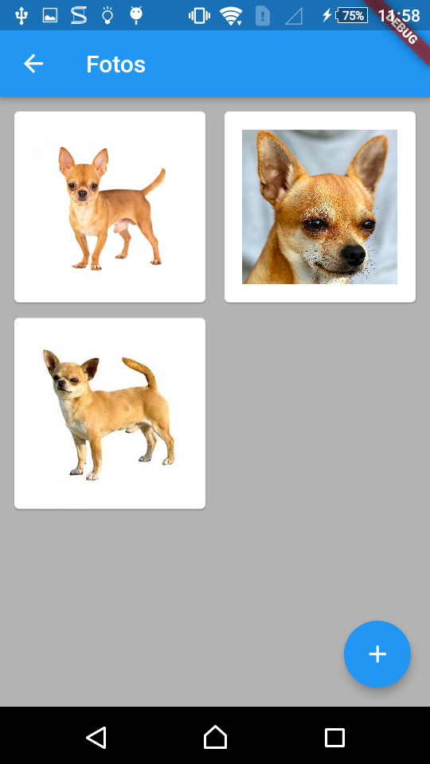
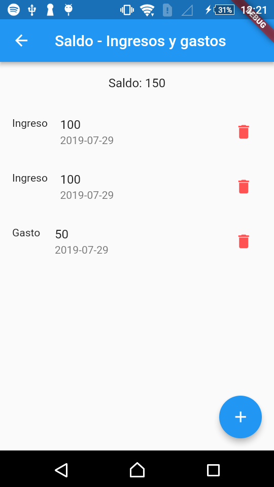

# Bicheros FrontMobile

En este repositorio se encuentra todo el desarrollo de la parte movil del proyecto de "Bicheros". En el, se podra, entre otras cosas, gestionar los registros de animales, donaciones, adoptantes, saldo, y hogares para los animales. Todo desde un dispositivo movil de preferencia Android.








## Empezando

Estas instrucciones le proporcionarán una copia del proyecto en funcionamiento en su máquina local para fines de desarrollo y prueba.

### Prequisitos

```
Android Studio
Dart
Flutter
```

### Installacion

Clonar el repositorio.

```
Git clone https://github.com/MateoCetti/Bicheros-FrontMobile
```

Cambiar el directorio al del proyecto.

```
cd Bicheros-FrontMobile/
```

Instalar las dependencias

```
flutter pub get
```

Correr el proyecto

```
flutter run
```

## Construido con

* [Flutter](http://www.dropwizard.io/1.0.2/docs/) - El framework usado
* [flutter_spinkit](https://pub.dev/packages/flutter_spinkit) - Indicadores de cargando animados
* [image_picker](https://pub.dev/packages/image_picker) - Libreria para elegir imagenes de la galeria
* [dio](https://pub.dev/packages/dio) - Un poderoso cliente HTTP para Dart
* [flutter_picker](https://pub.dev/packages/flutter_picker) - Selector de complementos
* [rflutter_alert](https://pub.dev/packages/rflutter_alert) - Dialogos "pop up" de alerta para flutter.
* [youtube_player](https://pub.dev/packages/youtube_player) - Un complemento de flutter para reproducir videos de YouTube "en línea" sin clave API

## Autores

* **Mateo P. Cetti** - [GitHub](https://github.com/MateoCetti)

